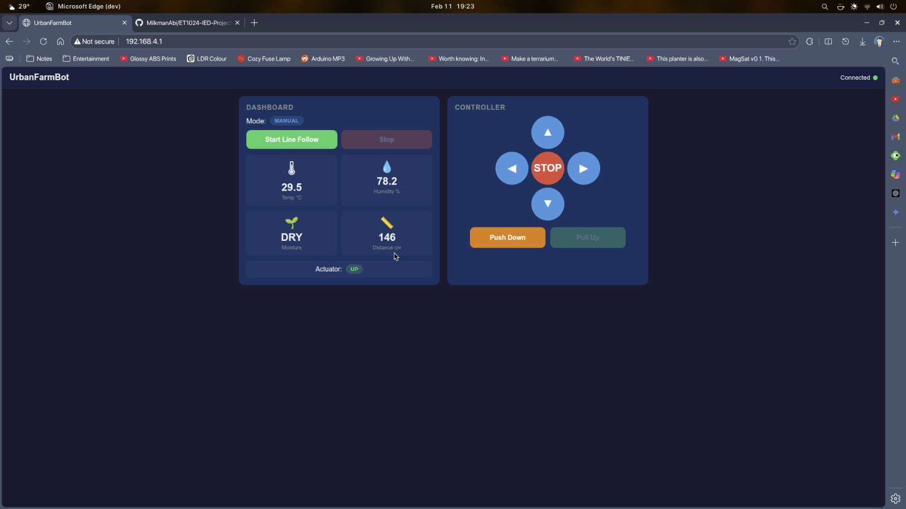

# Agri-Bot Autonomous Farm Rover Proof-Of-Concept

> Mobile environmental monitoring system built for the SP IED (Innovation by Design) course — Semester 2, Project 3.

A two-wheeled robot that autonomously follows a line track while collecting climate data (temperature, humidity, soil moisture, light) and streaming it to a real-time web dashboard over WiFi.



## Architecture

The system uses a **dual-MCU design**:

- **Arduino Uno** handles real-time sensor reading, motor control, and line-following logic.
- **Wifi Module** runs a WiFi access point with a WebSocket-based dashboard for remote control and live telemetry.

The two boards communicate over a 9600-baud serial link.

## Hardware

| Component | Role |
|---|---|
| Arduino Uno + IED Shield | Main controller — sensors, motors, line-following |
| Wifi Module | WiFi AP, web dashboard, servo actuator |
| MX1508 H-Bridge + 2WD Base | Differential drive |
| HC-SR04 Ultrasonic | Obstacle detection |
| 2x IR Sensors | Line tracking |
| DHT22 | Temperature and humidity |
| Soil Moisture Sensor | Soil moisture level (digital) |
| LDR | Light intensity |
| PIR Sensor | Motion detection |
| MG996R Servo (360°) | Actuator mechanism |
| 16x2 I2C LCD | On-board display |

## Folder Structure

```
ET1024-IED-Project-3/
├── Arduino_Uno_Firmware/      Arduino Uno sketch (sensors, motors, serial comms)
├── WebServer/            sketch (WiFi AP, web dashboard, servo)
├── Urban_robot_arduino/       Legacy integrated sketch
├── control_panel.jpeg         Control panel reference
├── Variable Reference Guide - Urban Farming Robot.pdf
├── LICENSE
└── README.md
```

## Getting Started

### Arduino Uno

Install these libraries via **Sketch > Include Library > Manage Libraries**:

| Library | Notes |
|---|---|
| LiquidCrystal_I2C (v1.1.2) | I2C LCD display |
| DHT sensor library (Adafruit) | DHT22 sensor |
| Adafruit Unified Sensor | Required by DHT library |

Upload `Arduino_Uno_Firmware/Arduino_Uno_Firmware.ino` to the Uno.

### WifiModule

Install these libraries:

| Library | Notes |
|---|---|
| ESPAsyncWebServer | Async HTTP + WebSocket server |
| AsyncTCP | Required by ESPAsyncWebServer |

Upload `WebServer/WebServer.ino` to the Module. On boot it creates a WiFi AP:

| Setting | Value |
|---|---|
| SSID | `UrbanFarmBot` |
| Password | `farm1234` |
| Dashboard | `http://192.168.4.1` |

Connect to the AP from any device and open the dashboard to control the robot and view live sensor data.

## License

See [LICENSE](LICENSE) for details.
